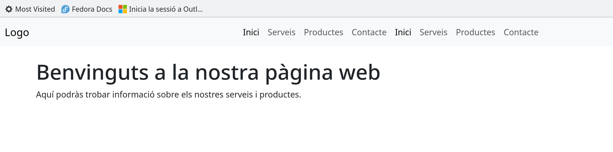
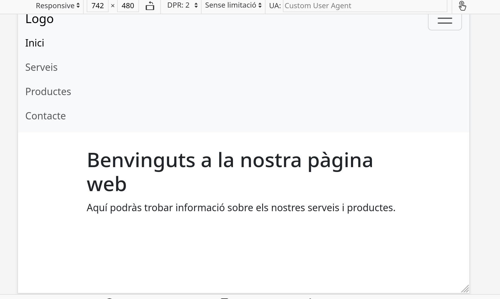

## Exemple de web responsive

Aquí tens un exemple senzill d'una pàgina web amb un menú horitzontal per a pantalles grans i un menú vertical per a pantalles petites utilitzant Bootstrap 5. Aquest exemple utilitza el Navbar de Bootstrap juntament amb les classes de visibilitat responsiva per aconseguir-ho:

```html
<!DOCTYPE html>
<html lang="ca">
<head>
  <meta charset="UTF-8">
  <meta name="viewport" content="width=device-width, initial-scale=1">
  <link rel="stylesheet" href="https://cdn.jsdelivr.net/npm/bootstrap@5.3.0/dist/css/bootstrap.min.css">
  <title>Web Responsive amb Bootstrap</title>
</head>
<body>

<!-- Navbar -->
<nav class="navbar navbar-expand-lg navbar-light bg-light">
  <div class="container-fluid">
    <!-- Logotip o nom del lloc -->
    <a class="navbar-brand" href="#">Logo</a>

    <!-- Botó de la barra de navegació per a pantalles petites -->
    <button class="navbar-toggler" type="button" data-bs-toggle="collapse" data-bs-target="#navbarNav" aria-controls="navbarNav" aria-expanded="false" aria-label="Toggle navigation">
      <span class="navbar-toggler-icon"></span>
    </button>

    <!-- Menú de navegació horitzontal per a pantalles grans -->
    <div class="collapse navbar-collapse justify-content-end" id="navbarNav">
      <ul class="navbar-nav">
        <li class="nav-item">
          <a class="nav-link active" href="#">Inici</a>
        </li>
        <li class="nav-item">
          <a class="nav-link" href="#">Serveis</a>
        </li>
        <li class="nav-item">
          <a class="nav-link" href="#">Productes</a>
        </li>
        <li class="nav-item">
          <a class="nav-link" href="#">Contacte</a>
        </li>
      </ul>
    </div>

    <!-- Menú de navegació vertical per a pantalles petites -->
    <div class="collapse navbar-collapse" id="navbarNavVertical">
      <ul class="navbar-nav">
        <li class="nav-item">
          <a class="nav-link active" href="#">Inici</a>
        </li>
        <li class="nav-item">
          <a class="nav-link" href="#">Serveis</a>
        </li>
        <li class="nav-item">
          <a class="nav-link" href="#">Productes</a>
        </li>
        <li class="nav-item">
          <a class="nav-link" href="#">Contacte</a>
        </li>
      </ul>
    </div>
  </div>
</nav>

<!-- Contingut principal -->
<div class="container mt-4">
  <h1>Benvinguts a la nostra pàgina web</h1>
  <p>Aquí podràs trobar informació sobre els nostres serveis i productes.</p>
</div>

<!-- Scripts de Bootstrap i jQuery (opcional) -->
<script src="https://cdn.jsdelivr.net/npm/bootstrap@5.3.0/dist/js/bootstrap.bundle.min.js"></script>
</body>
</html>
```

En aquest exemple:

- S'utilitza la classe `navbar-expand-lg` per a la barra de navegació principal, indicant que el Navbar es mostrarà horitzontalment en pantalles grans.
- S'afegeix un botó de barra de navegació (`navbar-toggler`) que es mostra només en pantalles petites i esclata el menú quan es fa clic.
- S'afegeixen dues instàncies del menú de navegació (una per a pantalles grans i una per a pantalles petites) dins del mateix Navbar.
- S'afegeix la classe `justify-content-end` a la versió horitzontal del menú per a centrar-lo a la dreta.

Amb aquesta configuració, el menú serà horitzontal per a pantalles grans i es convertirà en un menú vertical per a pantalles més petites. Això proporciona una experiència de navegació millorada en dispositius mòbils.

### Explicació del botó

!!! note "Botó per pantalles menudes"

    Aquesta funcionalitat és aconseguida mitjançant l'ús del component `navbar-toggler` de Bootstrap i les classes de visibilitat responsiva.


#### **Afegir el Botó Toggle:**
   - S'ha afegit un botó amb la classe `navbar-toggler` dins del Navbar. Aquest botó s'utilitzarà per mostrar o amagar el menú quan es visualitzi en pantalles petites.

    ```html
    <button class="navbar-toggler" type="button" data-bs-toggle="collapse" data-bs-target="#navbarNav" aria-controls="navbarNav" aria-expanded="false" aria-label="Toggle navigation">
      <span class="navbar-toggler-icon"></span>
    </button>
    ```

    Aquest botó és visible només en pantalles petites gràcies a les classes de visibilitat responsiva de Bootstrap.

#### **Afegir les Classes de Visibilitat Responsiva:**
   - S'ha utilitzat la classe `navbar-expand-lg` al Navbar per indicar que el Navbar es mostrarà horitzontalment només en pantalles amb una amplada igual o superior a lg (992 píxels).

    ```html
    <nav class="navbar navbar-expand-lg navbar-light bg-light">
    ```

   - A més, s'ha utilitzat la classe `collapse navbar-collapse` juntament amb la propietat `id="navbarNav"` al menú de navegació horitzontal. Aquesta propietat és referenciada pel botó Toggle per mostrar o amagar el menú quan es fa clic al botó.

    ```html
    <div class="collapse navbar-collapse" id="navbarNav">
    ```

   - S'ha utilitzat la classe `collapse navbar-collapse` juntament amb la propietat `id="navbarNavVertical"` al menú de navegació vertical. Aquesta propietat també és referenciada pel botó Toggle per a la versió vertical.

    ```html
    <div class="collapse navbar-collapse" id="navbarNavVertical">
    ```

Amb aquestes classes, el Navbar serà horitzontal només en pantalles grans (992 píxels o més), i quan la pantalla sigui més petita, apareixerà el botó Toggle. Quan es faci clic al botó, es mostrarà el menú vertical o horitzontal segons la disposició de la pantalla. Això proporciona una millora significativa en la usabilitat en dispositius mòbils.






