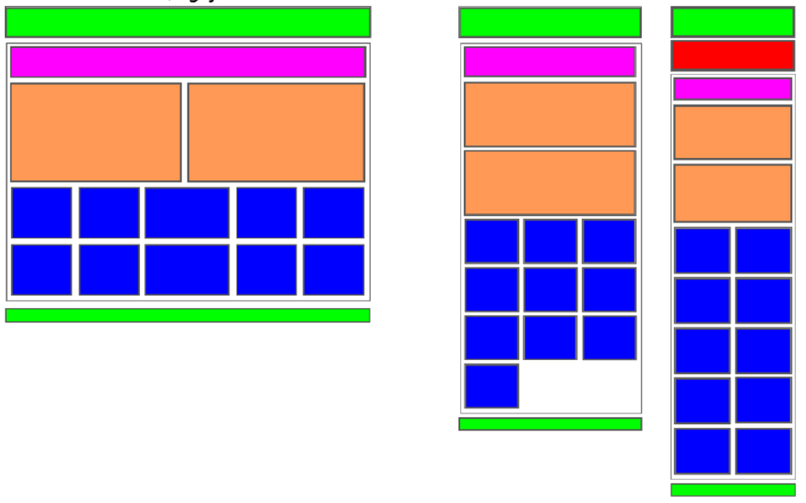

## Exercici responsive

Realitza un disseny responsive que es parega a la següent imatge.

## Exercici maquetació

Realitza la maquetació en Bootstrap per a que la web tinga una aparença similar a [aquesta](./recursos/exercici1examen.zip)

- Modifica el menú per a que tinga algun element deplegable.
- Fes un `carousel` afegint imatges i que apareguen captions.
- Mostra alguna informació dins de `accordions`
- Afegeix més efectes que trobes d'interés entre els diferents elements de `Bootstrap`

